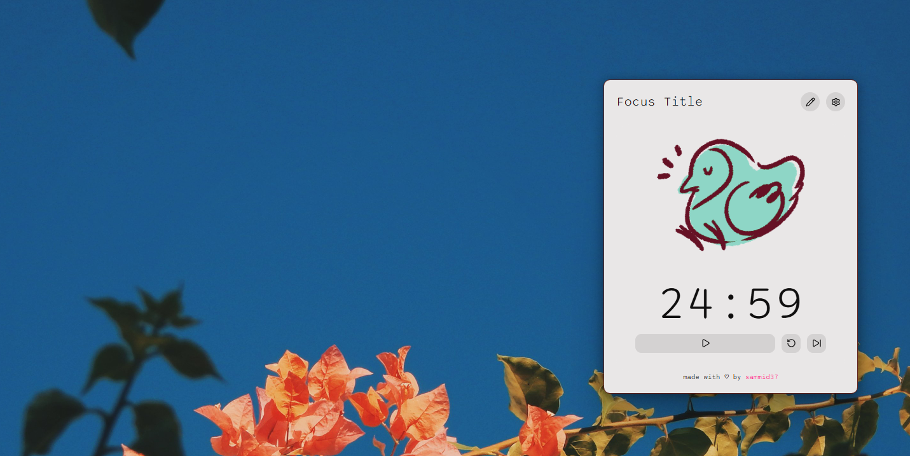

# 🐦 BirdFocus

A Pomodoro app with a bird theme.

### Preview

_coming soon_.



### Features
- Coming soo.
- Coming soo.
- Coming soo.
- Coming soo.

## 💾 Install

1. Clone this repo
2. Install dependencies
```sh
npm install
```
3. Run the app
```sh
npm run start
```

### Project Structure
```markdown
BirdFocus
├── node_modules
├── main.js
├──index.html
├── styles.css
├── script.js
├── package.json
└── package-lock.json
```

- `main.js`: Electron’s main process. Creates the app window and loads the HTML file.
- `index.html`: The main UI layout of your desktop app.
- `styles.css`: Styles for your app UI, including draggable window behavior.
- `script.js`: Frontend JavaScript logic for interactivity.
- `package.json`: App configuration, dependencies, and run scripts

### Dependencies
This project utilized the following technologies:


<!-- https://simpleicons.org/ -->
<!-- https://fonts.google.com/specimen/Sono?categoryFilters=Appearance:%2FMonospace%2FMonospace -->


## 🌼 Credits
This Pomodoro app project was inspired by [Nasha-Wanich's projects](https://github.com/nasha-wanich) (also made with ElectronJS).

The 2D animations were hand-drawn by me, without the use of generative artificial intelligence. If you'd like, you can see my illustrations on the social media links below.

[](https://www.instagram.com/art.sammid)
[](https://www.artstation.com/sammid37)
[](https://www.behance.net/art.sammid)